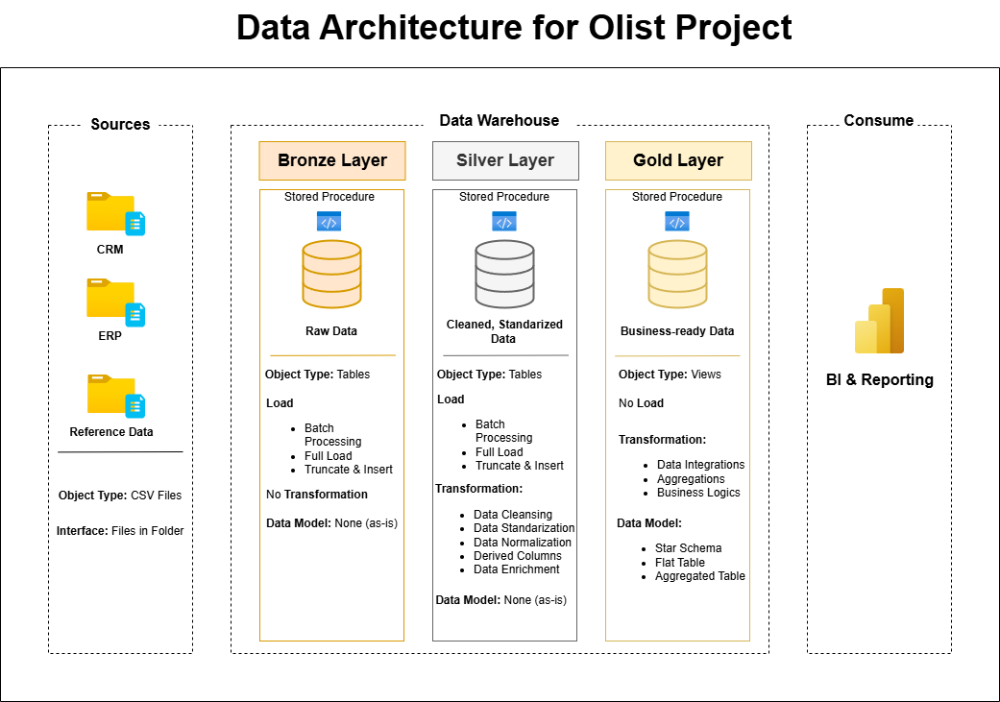

# 🏗️ Olist End-to-End Data Warehouse Project

This project demonstrates the design and implementation of a structured data warehouse using the Medallion Architecture (Bronze → Silver → Gold → Analytic) on Olist e-commerce data.

The objective was to transform raw transactional CSV data into a governed, business-ready model and generate analytical insights using SQL and BI dashboards.

**Dataset size:** 100k+ transactions

---

## 📌 Project Scope

Data sources were conceptually categorized for architectural clarity:

- **ERP** → Orders, Order Items, Payments, Products, Sellers  
- **CRM** → Customers, Reviews  
- **Reference Data** → Geolocation, Category Translation  

The focus areas:

- Clean architecture  
- Structured transformations  
- Dimensional modeling  
- Analytical reporting  

---

## 🏛️ Data Architecture

 

 

This project follows a strict Medallion structure:

### 🥉 Bronze Layer (Raw Ingestion)

- Raw CSV data loaded as-is  
- No transformations  
- Batch processing  
- Schema isolation (`bronze`)  

---

### 🥈 Silver Layer (Standardization)

- Data cleansing  
- Standardization  
- Derived columns  
- Business-ready formats  
- Schema: `silver`  

---

### 🥇 Gold Layer (Dimensional Model)

- Star Schema implementation  
- Fact & Dimension tables  
- Surrogate keys (`_key`)  
- Enforced PK–FK relationships  
- Schema: `gold`  

**Core Tables:**

- `fact_orders`  
- `fact_reviews`  
- `dim_customers`  
- `dim_products`  
- `dim_sellers`  

---

### 📊 Analytic Layer

Built strictly on top of the Gold layer.

Used for:

- KPI computation  
- Ranking analysis  
- Cumulative trend analysis  
- Segmentation  
- Change-over-time analysis  
- Business reports  

Schema: `analytic`

---

## 🔁 Data Flow Governance

Strict dependency rule enforced:

